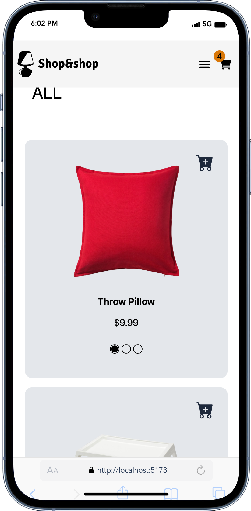
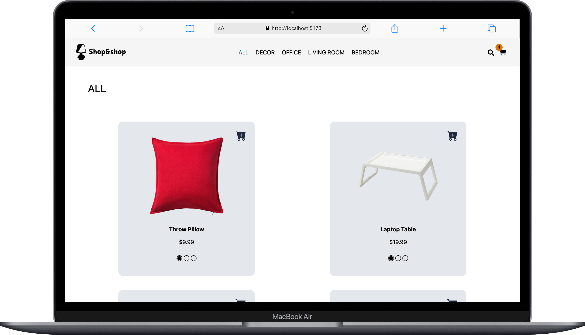

# Shop & Shop App

# React + TypeScript + Vite

Welcome to my web page project, where I've used React + TypeScript + Vite and tailwind to create a simple e commerce site - shop&shop. 

## Project Overview

This web application serves as a user-friendly, responsive e-commerce site. Dark/light theme of app is synchronized the dark/light theme of system preferences. 

## Screenshots

Here are a couple of screenshots from my project:

  

## Technologies Used
- Vite
- React
- TypeScript
- Tailwind
- shad/cn (tailwind ui)

### Links
- git clone : https://github.com/Sumeyye-Mete/shop-and-shop.git
- live site URL : 

